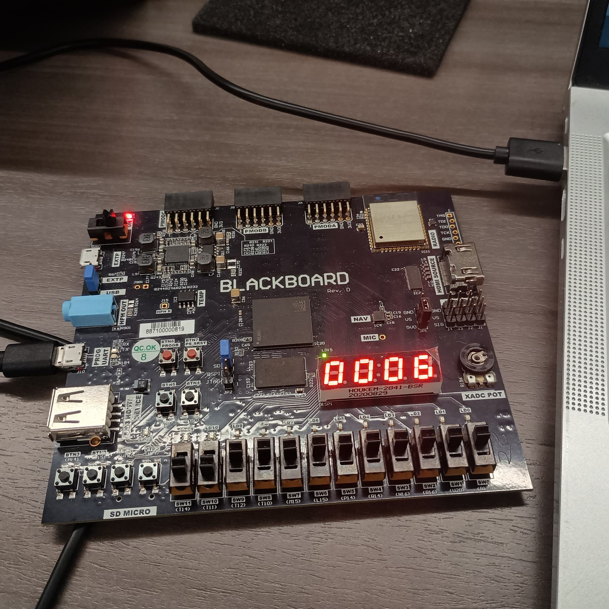

# ⏱️ 7-Segment Stopwatch — Embedded Systems Project

A personal embedded systems project implementing a **start / stop / reset stopwatch** on the BlackBoard’s **4-digit 7-segment display**, using **memory-mapped I/O** in C.  
The stopwatch uses three push buttons to control counting and displays the value in **hexadecimal**.

---

## 🧭 Features
- 4-digit **hex stopwatch** that increments every second  
- **BTN0** → Start  
- **BTN1** → Stop  
- **BTN2** → Reset to `0000`  
- Edge detection to avoid retriggering on long presses  
- Simple digit packing logic for display control

---

## 🧰 Hardware & Memory Map
| Component               | Address         | Description                            |
|-------------------------|-----------------|-----------------------------------------|
| 7-Segment Control Reg   | `0x43C10000`    | Enables HEX mode                       |
| 7-Segment Data Reg      | `0x43C10004`    | Holds digit values and decimal point   |
| Button GPIO (lower 4b)  | `0x41200000`    | Reads BTN0–BTN3 state                  |

- MSB bit (bit 7) of each digit disables the decimal point.  
- HEX mode is enabled by writing `1` to `SEG_CTL`.

---

## 🧠 Core Logic (C)
```c
#include <stdint.h>
#include "sleep.h"

#define SEG_CTL    (*(volatile uint32_t*)0x43C10000)
#define SEG_DATA   (*(volatile uint32_t*)0x43C10004)
#define BTN        (*(volatile uint32_t*)0x41200000)

static inline void display_hex(uint16_t n) {
    SEG_CTL = 1;  // enable HEX mode
    uint8_t d0 =  n        & 0xF;
    uint8_t d1 = (n >> 4)  & 0xF;
    uint8_t d2 = (n >> 8)  & 0xF;
    uint8_t d3 = (n >> 12) & 0xF;
    uint32_t packed = (0x80 | d0) |
                      ((0x80 | d1) << 8) |
                      ((0x80 | d2) << 16) |
                      ((0x80 | d3) << 24);
    SEG_DATA = packed;
}

int main(void) {
    uint16_t counter = 0;
    int running = 0;
    uint32_t prev = 0;

    while (1) {
        uint32_t btn = BTN & 0xF;
        uint32_t rising = (~prev) & btn;

        if (rising & 0x1) running = 1;   // Start
        if (rising & 0x2) running = 0;   // Stop
        if (rising & 0x4) counter = 0;   // Reset

        if (running) {
            counter++;
            sleep(1);
        }
        display_hex(counter);
        prev = btn;
    }
}
```

---

## 🧪 How to Run
1. Open Vitis or XSCT environment.  
2. Create a **Standalone C Application** targeting the BlackBoard BSP.  
3. Add `stopwatch.c` to the `src/` folder.  
4. Build the project and **Run on Hardware**.  
5. BTN0 starts the count, BTN1 stops it, BTN2 resets it.

---

## 📸 Demo
Add your photos inside the `Images` folder and reference them like this:

```markdown


```

---

## 📂 Suggested Repository Structure
```
seven-seg-stopwatch/
├─ README.md
├─ src/
│  └─ stopwatch.c
├─ Images/
│  ├─ blackboard_stopwatch.jpg
│  └─ seg_close.jpg
└─ Docs/
   └─ lab_report.pdf
```

---

## 🚀 Future Enhancements
- Implement **BCD** counting with `MM:SS` display.  
- Add **debounce / timer interrupts** for better accuracy.  
- Long-press detection for reset.  
- Optional lap timer functionality.

---

## 🙋 Author
**Rabeea Fatima**  
Electrical & Computer Engineering  
Focus: Embedded Systems · FPGA · Microprocessors
